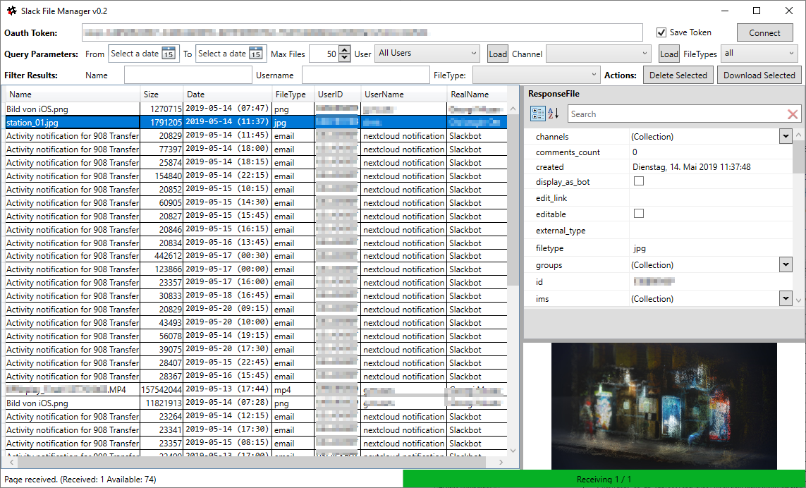

# SlackFileManager

DISCLAIMER: This is NOT a polished tool. It's something I whipped up to help me in my admin tasks. Be warned that there may be (severe) bugs. Since this tool is all about deleting files, that is exactly what may happen: it'll delete files and there's always a chance that it may be deleting more than you planned for. You are using this at your own risk. Consider yourself warned!

A C#/WPF desktop wrapper for the Slack Web API to make managing files a little easier.

Slack, for whatever reason, does not offer a proper interface for administrators to manage uploaded files in their Slack environment. The only way is some opaque procedure by asking Support to delete them all for them, which is not ideal.

However, Slack _does_ offer quite an extensive API which will let you files.list and files.delete. Thus, this application.

The target audience are Slack owners or administrators, not end users.

- You'll need to register an app under https://api.slack.com/apps to receive an Oauth Token to be used for authentication.
- You'll also need to set up the following permissions:
channels:read
groups:read
files:read
files:write:user
users:read

Since the API is rate-limited, requests for a large amount of file listings are made at intervals. Same goes for deletion. (roughly once per second (1250ms currently, as the rate is limited to 50+ requests per second)

Usage is pretty straight forward. Enter how many items you want to load at most and optionally limit them by date range and username (update the user list with the "Load" button in advance for this). Press connect to start updating the list. Select files in the list and press Delete Selected for just that. The sidebar shows properties for each item.

